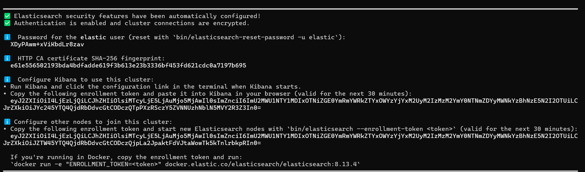

# Spring elastic search
1. Cài đặt elastic search
### Cách cài đặt 
[https://www.elastic.co/guide/en/elasticsearch/reference/current/docker.html](https://www.elastic.co/guide/en/elasticsearch/reference/current/docker.html)
- Video hướng dẫn [https://www.youtube.com/watch?v=Bs41dR_Kf-0&list=PLw0w5s5b9NK6i5U4RH9dsZTzYgI893vON](https://www.youtube.com/watch?v=Bs41dR_Kf-0&list=PLw0w5s5b9NK6i5U4RH9dsZTzYgI893vON)

Sau khi cài đặt xong truy cập https://localhost:9200. Trang web sẽ yêu cầu nhập tên tài khỏan và mật khẩu.
- username là elastic
- pass là password sinh ra sau khi chạy


### Một số thao tác với elasticsearch app [http://localhost:5601/app](http://localhost:5601/app/dev_tools#/console)
#### Các câu lệnh trên dev-tools
```manifest
# Click the Variables button, above, to create your own variables.
POST aliconcon/_doc
{
  "@timestamp": "2024-05-12",
  "username": "khai",
  "channel": "ccptpm"
}

# add multiple data
POST aliconcon/_bulk
{"create": {}}
{"@timestamp": "2024-05-12", "username": "cr7", "channel": "tip javascript"}
{"create": {}}
{"@timestamp": "2024-05-12", "username": "cr7", "channel": "tip javascript"}
{"create": {}}
{"@timestamp": "2024-05-12", "username": "cr7", "channel": "tip javascript"}

GET _cat/indices

# search data
GET aliconcon/_search
{
  "query": {
    "match_all": {}
  },
  "fields": [
    "@timestamp", "username"
  ], 
  "_source": false, 
  "sort": [
    {
      "@timestamp": {
        "order": "desc"
      }
    }
  ]
}

# Neu tồn tại id thì cập nhật thuộc tính mớ, nếu không thì tạo mới
PUT aliconcon/_doc/1001
{
  "user": "cr7",
  "uid": 1001,
  "team": "Juve",
  "age": 38
}

# get mapping(các trường kiểu dữ liệu đã được định nghĩa)
GET aliconcon/_mapping

# add or change model mapping
PUT aliconcon/_mapping
{
  "properties": {
    "number": {
     "type": "integer" 
    }
  }
}

# create data
PUT aliconcon/_create/1002
{
  "user": "m10",
  "uid": 1002,
  "team": "PSV",
  "age": 36
}
# hoặc
PUT aliconcon/_doc/1003?op_type=create
{
  "user": "khai",
  "uid": 1004,
  "team": "java",
  "age": 20
}

# get data

## get multiple
GET _mget 
{
  "docs": [
    {
      "_index": "aliconcon",
      "_id": 1001,
      "_source": ["user", "team"]
    },
    {
      "_index": "aliconcon",
      "_id": 1002,
      "_source": ["age", "uid"]
    }
  ]
}

## get data by id
GET aliconcon/_doc/1001?_source=user,team

## check exists
HEAD aliconcon/_doc/1001

# Delete
## delete by id
DELETE aliconcon/_doc/1001

## delete by query
POST aliconcon/_delete_by_query
{
  "query": {
    "match": {
      "age": 20
    }
  }
}

# Count element
GET aliconcon/_count
```